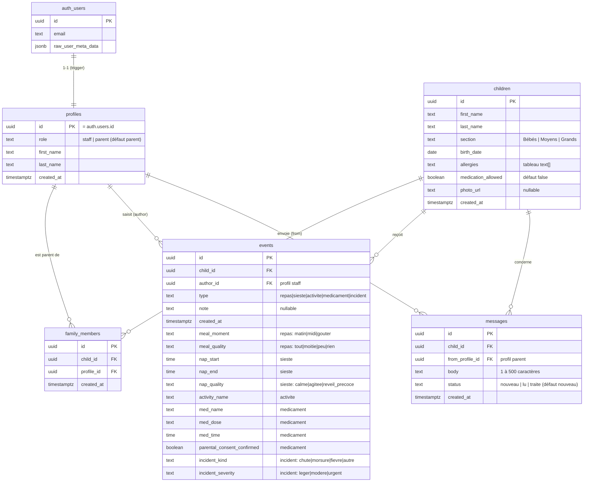

# Modèle de données — Les Petits Pas

Base **PostgreSQL** hébergée sur **Supabase**. Schéma `public`, sauf `auth.users`
géré par Supabase Auth.

Scripts de création : [`../supabase/`](../supabase/) (`01_schema.sql` → `05_rls_test.sql`).

## Diagramme (Mermaid)

## Dictionnaire des données

### `profiles`
Profil applicatif, une ligne par compte. Créé automatiquement par le trigger
`on_auth_user_created` à chaque insertion dans `auth.users`.

| Colonne | Type | Contraintes | Notes |
|---|---|---|---|
| `id` | uuid | PK, FK → `auth.users(id)` ON DELETE CASCADE | Vaut `auth.uid()` |
| `role` | text | NOT NULL, défaut `parent`, CHECK `in ('staff','parent')` | Jamais modifiable depuis l'app (GRANT de colonne) |
| `first_name` | text | NOT NULL, défaut `''` | Affiché comme auteur d'événement / émetteur de message |
| `last_name` | text | NOT NULL, défaut `''` | |
| `created_at` | timestamptz | NOT NULL, défaut `now()` | |

### `children`

| Colonne | Type | Contraintes | Notes |
|---|---|---|---|
| `id` | uuid | PK, défaut `gen_random_uuid()` | |
| `first_name` | text | NOT NULL | |
| `last_name` | text | NOT NULL | |
| `section` | text | NOT NULL, CHECK `in ('Bébés','Moyens','Grands')` | |
| `birth_date` | date | NOT NULL | Âge calculé côté interface |
| `allergies` | text[] | NOT NULL, défaut `'{}'` | Liste d'affichage ; pas de requête par allergie → tableau plutôt qu'une table |
| `medication_allowed` | boolean | NOT NULL, défaut `false` | Autorisation parentale de médicament |
| `photo_url` | text | nullable | Si renseignée, affichée telle quelle ; sinon initiales |
| `created_at` | timestamptz | NOT NULL, défaut `now()` | |

### `family_members`
Relation **n..n** parent ↔ enfant. Noms de colonnes imposés par l'énoncé.

| Colonne | Type | Contraintes | Notes |
|---|---|---|---|
| `id` | uuid | PK | |
| `child_id` | uuid | NOT NULL, FK → `children(id)` ON DELETE CASCADE | |
| `profile_id` | uuid | NOT NULL, FK → `profiles(id)` ON DELETE CASCADE | Un parent |
| `created_at` | timestamptz | NOT NULL, défaut `now()` | |
| | | UNIQUE `(child_id, profile_id)` | Un lien unique par couple |

### `events`
**Tous les types d'événements dans une seule table** (repas, sieste, activité,
médicament, incident). Discriminant `type` + colonnes par type, nullables,
encadrées par la contrainte `events_type_fields_ck` qui **refuse toute ligne
incohérente** (bons champs remplis, champs des autres types à `NULL`).

| Colonne | Type | Rempli pour | Notes |
|---|---|---|---|
| `id` | uuid | tous | PK |
| `child_id` | uuid | tous | FK → `children` |
| `author_id` | uuid | tous | FK → `profiles` — le membre de l'équipe qui a saisi |
| `type` | text | tous | CHECK `in ('repas','sieste','activite','medicament','incident')` |
| `note` | text | tous (optionnel) | Note libre |
| `created_at` | timestamptz | tous | Sert au tri de la timeline (desc) |
| `meal_moment` | text | repas | `matin` / `midi` / `gouter` |
| `meal_quality` | text | repas | `tout` / `moitie` / `peu` / `rien` |
| `nap_start`, `nap_end` | time | sieste | Durée calculée côté interface |
| `nap_quality` | text | sieste | `calme` / `agitee` / `reveil_precoce` |
| `activity_name` | text | activité | Ex. peinture, sortie parc |
| `med_name`, `med_dose` | text | médicament | |
| `med_time` | time | médicament | |
| `parental_consent_confirmed` | boolean | médicament | Doit être `true` (contrainte). La vérif de `children.medication_allowed` se fait **en plus**, côté Server Action |
| `incident_kind` | text | incident | `chute` / `morsure` / `fievre` / `autre` |
| `incident_severity` | text | incident | `leger` / `modere` / `urgent` |

Index : `(child_id, created_at desc)` pour la timeline.

### `messages`
Message d'un parent vers l'équipe. Modèle **asynchrone** (pas de temps réel).

| Colonne | Type | Contraintes | Notes |
|---|---|---|---|
| `id` | uuid | PK | |
| `child_id` | uuid | NOT NULL, FK → `children` | Enfant concerné |
| `from_profile_id` | uuid | NOT NULL, FK → `profiles` | Le parent émetteur |
| `body` | text | NOT NULL, CHECK `char_length between 1 and 500` | Limite des 500 caractères en base aussi |
| `status` | text | NOT NULL, défaut `nouveau`, CHECK `in ('nouveau','lu','traite')` | Mis à jour par le staff |
| `created_at` | timestamptz | NOT NULL, défaut `now()` | Tri de la liste staff (desc) |

Index : `(created_at desc)`, `(child_id)`.

## Choix de conception (à justifier en soutenance)

1. **`profiles` séparé de `auth.users`** : `auth.users` appartient à Supabase.
   On ajoute nos champs métier (rôle, prénom) dans `profiles`, liée 1-1 par un
   trigger.
2. **Rôle attribué en base, jamais par l'app** : le trigger met toujours
   `parent` ; le staff est promu par script SQL. Empêche l'auto-attribution de
   `staff` via les métadonnées d'inscription. La colonne `role` est en plus
   protégée par un GRANT de colonne (l'app ne peut UPDATE que `first_name` /
   `last_name`).
3. **`family_members` (table de jonction)** : un enfant a 1 ou 2 familles, une
   personne peut être parent de plusieurs enfants → relation n..n, donc table
   dédiée. C'est elle qui porte toute l'isolation des données côté parent.
4. **Une seule table `events`** : les 5 types partagent l'essentiel (enfant,
   auteur, horodatage, note) et ne diffèrent que par quelques champs. Une table
   par type multiplierait les jointures pour afficher une timeline. Colonnes
   typées + `CHECK` → l'intégrité est garantie par la base, pas seulement par
   l'app.
5. **`allergies` en `text[]`** : donnée d'affichage, jamais filtrée par allergie
   individuelle. Une table `allergies` serait de la sur-normalisation ici.
6. **Valeurs d'énumération en ASCII** (`activite`, `gouter`, `moitie`…) : évite
   les soucis d'encodage en base ; l'interface affiche les libellés accentués.
7. **Limite des 500 caractères sur `messages.body` en base** : double garde avec
   le compteur côté interface.

## Sécurité (RLS) — résumé

Détail dans [`../supabase/03_rls.sql`](../supabase/03_rls.sql). RLS activée sur
les 5 tables. Fonction `is_staff()` (SECURITY DEFINER) utilisée partout.

| Table | SELECT | INSERT | UPDATE |
|---|---|---|---|
| `profiles` | son profil, ou staff | trigger uniquement | son profil (hors `role`) |
| `children` | staff, ou parent rattaché | staff | staff |
| `family_members` | staff, ou son propre lien | script SQL | script SQL |
| `events` | staff, ou parent rattaché (via `child_id`) | staff (`author_id = auth.uid()`) | staff |
| `messages` | staff, ou parent rattaché | parent, pour un de ses enfants | staff (statut) |
